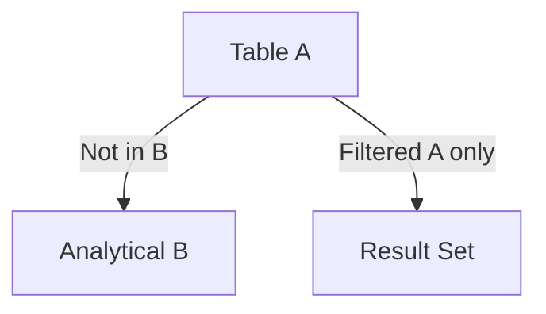

# ANTI JOIN (Advanced Template)

## 1. Purpose
Perform an analytical **NOT EXISTS** join where:
- A row from A is returned **only if** no qualifying row exists in B  
- B is window‑ranked to enforce business rules  
- Useful for exception reporting, anomaly detection, and gap analysis  

## 2. Four-Part Flow
- First Part: Analytical subquery Bx  
- Second Part: Main table A  
- Third Part: NOT EXISTS correlation  
- Fourth Part: Final SELECT (A‑only output)  

## 3. Template
```sql
WITH Bx AS (                                      -- First Part
    SELECT
        B.<join_key>,
        ROW_NUMBER() OVER (
            PARTITION BY B.<join_key>
            ORDER BY B.<priority> DESC
        ) AS rn,
        AVG(B.<value>) OVER (
            PARTITION BY B.<join_key>
        ) AS avg_value
    FROM <table_2> B
    WHERE B.<flag> = 'Y'
)
SELECT                                              -- Fourth Part
    A.<column_list_from_A>
FROM <table_1> A                                    -- Second Part
WHERE NOT EXISTS (                                  -- Third Part
    SELECT 1
    FROM Bx
    WHERE Bx.<join_key> = A.<join_key>
      AND Bx.rn = 1
);
```
