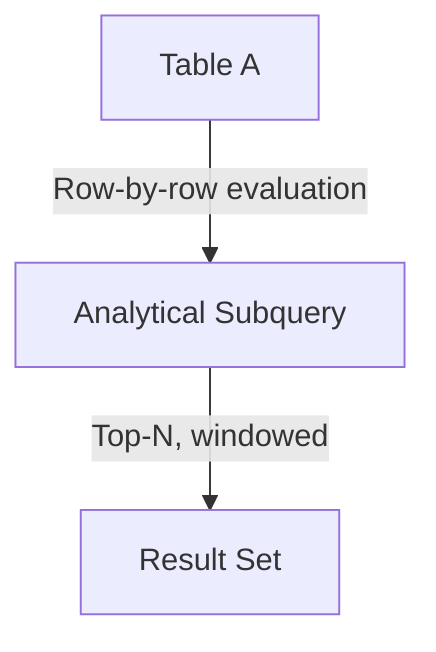

# CROSS APPLY — Advanced Template

## 1. Purpose
Perform a **row-by-row correlated subquery** where:
- Each row of A feeds parameters into a windowed, ranked subquery on B  
- Only the top analytical row per A is returned  
- Useful for enrichment, latest‑record lookups, scoring, and dynamic filtering  

## 2. Four-Part Flow
- First Part: Main table A  
- Second Part: Lateral analytical subquery B  
- Third Part: Correlated APPLY logic  
- Fourth Part: Final SELECT with enriched metrics  

## 3. Template
```sql
SELECT                                              -- Fourth Part
    A.<column_list_from_A>,
    Bx.<column_list_from_B>,
    Bx.total_metric,
    Bx.rn
FROM <table_1> A                                    -- First Part
CROSS APPLY (                                       -- Second Part
    SELECT TOP (1)
           B.<column_list_from_B>,
           ROW_NUMBER() OVER (
               PARTITION BY B.<partition_key>
               ORDER BY B.<updated_at> DESC
           ) AS rn,
           SUM(B.<metric>) OVER (
               PARTITION BY B.<partition_key>
           ) AS total_metric
    FROM <table_2> B
    WHERE B.<foreign_key> = A.<primary_key>         -- Third Part
      AND B.<status> IN ('Active','Pending')
      AND B.<date> >= DATEADD(DAY, -90, A.<event_date>)
    ORDER BY B.<priority> DESC, B.<created_at> DESC
) Bx;
```
