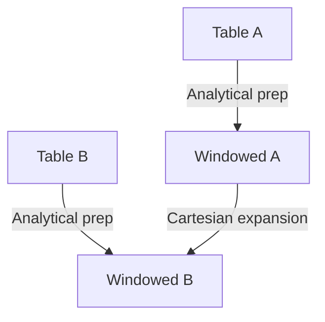

# CROSS JOIN — Advanced Template

## 1. Purpose
Generate a **dimensional expansion** where:
- Every analytical row from Ax pairs with every analytical row from Bx  
- Window metrics are precomputed on each side  
- Useful for scenario modeling, forecasting, matrix expansion, and simulation  

## 2. Four-Part Flow
- First Part: Analytical subquery Ax (from A)  
- Second Part: Analytical subquery Bx (from B)  
- Third Part: CROSS JOIN (no join condition)  
- Fourth Part: Final SELECT with combined metrics  

## 3. Template
```sql
WITH Ax AS (                                      -- First Part
    SELECT
        A.<column_list_from_A>,
        ROW_NUMBER() OVER (
            ORDER BY A.<sort_key>
        ) AS rnA,
        SUM(A.<metric>) OVER () AS totalA,
        AVG(A.<metric>) OVER () AS avgA
    FROM <table_1> A
    WHERE A.<status> = 'Active'
),
Bx AS (                                           -- Second Part
    SELECT
        B.<column_list_from_B>,
        ROW_NUMBER() OVER (
            ORDER BY B.<sort_key>
        ) AS rnB,
        SUM(B.<value>) OVER () AS totalB,
        COUNT(*) OVER () AS cntB
    FROM <table_2> B
    WHERE B.<category> IN ('High','Medium')
)
SELECT                                             -- Fourth Part
    Ax.<column_list_from_A>,
    Bx.<column_list_from_B>,
    Ax.totalA,
    Ax.avgA,
    Bx.totalB,
    Bx.cntB
FROM Ax                                           -- Third Part
CROSS JOIN Bx;
```
