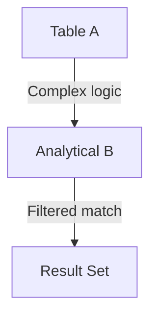

# COMPOSITE / LOGICAL JOIN — Advanced Template

## 1. Purpose
Perform a join using **complex logical expressions**, such as:
- OR‑based matching  
- Conditional matching  
- Multi‑predicate business rules  
- Analytical ranking to select the best logical match  

## 2. Four-Part Flow
- First Part: Analytical subquery Bx  
- Second Part: Main table A  
- Third Part: Logical join condition (OR / AND combinations)  
- Fourth Part: Final SELECT with analytical metrics  

## 3. Template
```sql
WITH Bx AS (                                      -- First Part
    SELECT
        B.<column_list_from_B>,
        ROW_NUMBER() OVER (
            PARTITION BY B.<group_key>
            ORDER BY B.<score> DESC
        ) AS rn,
        AVG(B.<metric>) OVER (
            PARTITION BY B.<group_key>
        ) AS avg_metric
    FROM <table_2> B
    WHERE B.<flag> = 'Y'
)
SELECT                                              -- Fourth Part
    A.<column_list_from_A>,
    Bx.<column_list_from_B>,
    Bx.avg_metric
FROM <table_1> A                                    -- Second Part
JOIN Bx                                             -- Third Part
    ON (
           A.<key1> = Bx.<key1>
        OR (A.<key2> = Bx.<key2> AND A.<status> = 'Active')
       )
   AND Bx.rn = 1;
```
