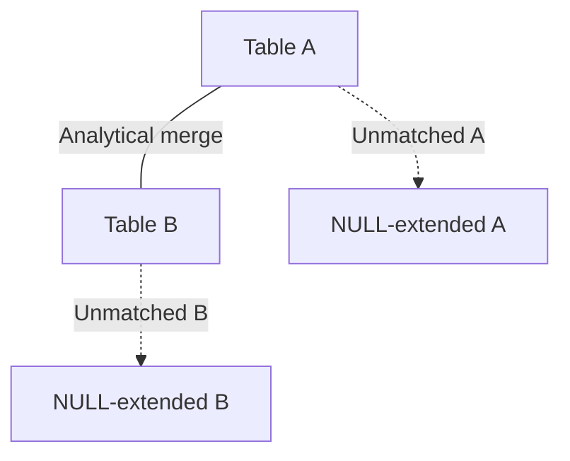

# FULL JOIN — Advanced Template

## 1. Purpose
Perform a **bidirectional analytical merge** where:
- Both A and B contribute rows  
- Window functions compute metrics independently on each side  
- COALESCE logic reconciles mismatched keys  
- NULL‑extended rows appear when either side lacks a match  

## 2. Four-Part Flow
- First Part: Analytical subquery Ax (from A)  
- Second Part: Analytical subquery Bx (from B)  
- Third Part: FULL JOIN with reconciliation logic  
- Fourth Part: Final SELECT with COALESCE and merged metrics  

## 3. Template
```sql
WITH Ax AS (                                      -- First Part
    SELECT
        A.<join_key>,
        A.<column_list_from_A>,
        ROW_NUMBER() OVER (
            PARTITION BY A.<partition_key>
            ORDER BY A.<updated_at> DESC
        ) AS rnA,
        SUM(A.<metric>) OVER (
            PARTITION BY A.<partition_key>
        ) AS totalA
    FROM <table_1> A
    WHERE A.<status> IN ('Active','Pending')
),
Bx AS (                                           -- Second Part
    SELECT
        B.<join_key>,
        B.<column_list_from_B>,
        ROW_NUMBER() OVER (
            PARTITION BY B.<partition_key>
            ORDER BY B.<priority> DESC
        ) AS rnB,
        AVG(B.<value>) OVER (
            PARTITION BY B.<partition_key>
        ) AS avgB
    FROM <table_2> B
    WHERE B.<effective_date> >= DATEADD(DAY, -90, GETDATE())
)
SELECT                                             -- Fourth Part
    COALESCE(Ax.<join_key>, Bx.<join_key>) AS unified_key,
    Ax.<column_list_from_A>,
    Bx.<column_list_from_B>,
    Ax.totalA,
    Bx.avgB
FROM Ax                                           -- Third Part
FULL JOIN Bx
    ON Ax.<join_key> = Bx.<join_key>
   AND (Ax.rnA = 1 OR Ax.rnA IS NULL)
   AND (Bx.rnB = 1 OR Bx.rnB IS NULL);
```
