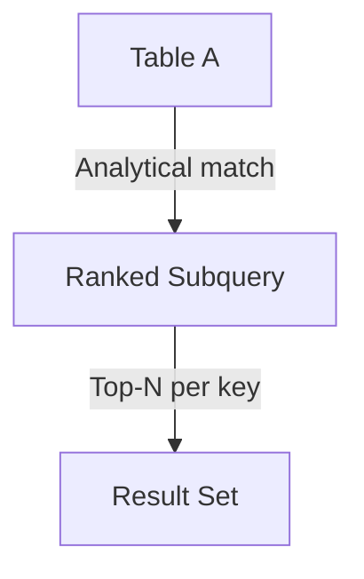

# INNER JOIN — Advanced Template

## 1. Purpose
Perform an analytical, multi‑predicate join where:
- Table B is pre‑ranked using window functions  
- Only the top‑ranked or business‑qualified rows are joined  
- Strict matching ensures analytical correctness  

## 2. Four-Part Flow
- First Part: Analytical subquery Bx  
- Second Part: Main table A  
- Third Part: INNER JOIN with ranking filter  
- Fourth Part: Final SELECT with enriched metrics  

## 3. Template
```sql
WITH Bx AS (                                      -- First Part
    SELECT
        B.<join_key>,
        B.<column_list_from_B>,
        ROW_NUMBER() OVER (
            PARTITION BY B.<partition_key>
            ORDER BY B.<sort_key> DESC
        ) AS rn,
        SUM(B.<metric>) OVER (
            PARTITION BY B.<partition_key>
        ) AS total_metric
    FROM <table_2> B
    WHERE B.<status> IN ('Active','Pending')
      AND B.<date> >= DATEADD(DAY, -90, GETDATE())
)
SELECT                                              -- Fourth Part
    A.<column_list_from_A>,
    Bx.<column_list_from_B>,
    Bx.total_metric
FROM <table_1> A                                    -- Second Part
INNER JOIN Bx                                       -- Third Part
    ON A.<join_key> = Bx.<join_key>
   AND Bx.rn = 1;
```
