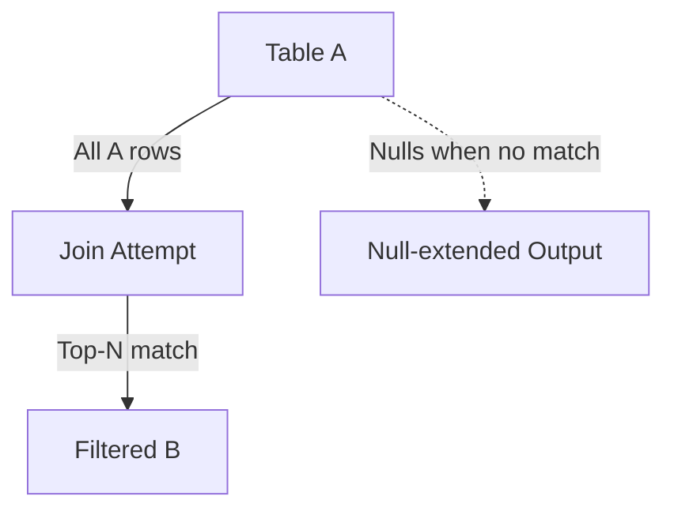

# LEFT JOIN — Advanced Template

## 1. Purpose
Return all rows from A while enriching them with:
- Top‑ranked analytical values from B  
- Window‑filtered metrics  
- Conditional business logic  
NULLs appear when no qualifying B row exists.

## 2. Four-Part Flow
- First Part: Analytical subquery Bx  
- Second Part: Main table A  
- Third Part: LEFT JOIN with ranking filter  
- Fourth Part: Final SELECT with NULL‑safe enrichment  

## 3. Template
```sql
WITH Bx AS (                                      -- First Part
    SELECT
        B.<join_key>,
        B.<column_list_from_B>,
        ROW_NUMBER() OVER (
            PARTITION BY B.<partition_key>
            ORDER BY B.<priority> DESC, B.<created_at> DESC
        ) AS rn,
        AVG(B.<value>) OVER (
            PARTITION BY B.<partition_key>
        ) AS avg_value
    FROM <table_2> B
    WHERE B.<status> = 'Active'
)
SELECT                                              -- Fourth Part
    A.<column_list_from_A>,
    Bx.<column_list_from_B>,
    Bx.avg_value
FROM <table_1> A                                    -- Second Part
LEFT JOIN Bx                                        -- Third Part
    ON A.<join_key> = Bx.<join_key>
   AND Bx.rn = 1;
```
