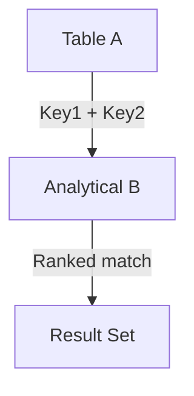

# MULTI‑COLUMN JOIN — Advanced Template

## 1. Purpose
Perform an analytical join where:
- Matching requires **multiple columns** (composite business keys)  
- B is window‑ranked to select the best match per composite key  
- Useful for multi‑attribute identity resolution, reconciliation, and deduplication  

## 2. Four-Part Flow
- First Part: Analytical subquery Bx  
- Second Part: Main table A  
- Third Part: Multi‑column join with ranking filter  
- Fourth Part: Final SELECT with enriched metrics  

## 3. Template
```sql
WITH Bx AS (                                      -- First Part
    SELECT
        B.<key1>,
        B.<key2>,
        B.<column_list_from_B>,
        ROW_NUMBER() OVER (
            PARTITION BY B.<key1>, B.<key2>
            ORDER BY B.<priority> DESC, B.<updated_at> DESC
        ) AS rn,
        SUM(B.<metric>) OVER (
            PARTITION BY B.<key1>, B.<key2>
        ) AS total_metric
    FROM <table_2> B
    WHERE B.<status> = 'Active'
)
SELECT                                              -- Fourth Part
    A.<column_list_from_A>,
    Bx.<column_list_from_B>,
    Bx.total_metric
FROM <table_1> A                                    -- Second Part
JOIN Bx                                             -- Third Part
    ON A.<key1> = Bx.<key1>
   AND A.<key2> = Bx.<key2>
   AND Bx.rn = 1;
```
