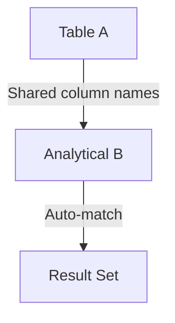

# NATURAL JOIN — Advanced Template

## 1. Purpose
Perform an analytical join where:
- Matching is automatically done on **all identically named columns**  
- Both tables are pre‑processed with window functions  
- Only top‑ranked or business‑qualified rows survive  
- Useful for standardized schemas and dimensional models  

## 2. Four-Part Flow
- First Part: Analytical subquery Ax  
- Second Part: Analytical subquery Bx  
- Third Part: NATURAL JOIN (auto column matching)  
- Fourth Part: Final SELECT with merged analytical metrics  

## 3. Template
```sql
WITH Ax AS (                                      -- First Part
    SELECT
        A.*,
        ROW_NUMBER() OVER (
            PARTITION BY A.<shared_column>
            ORDER BY A.<updated_at> DESC
        ) AS rnA,
        SUM(A.<metric>) OVER (
            PARTITION BY A.<shared_column>
        ) AS totalA
    FROM <table_1> A
),
Bx AS (                                           -- Second Part
    SELECT
        B.*,
        ROW_NUMBER() OVER (
            PARTITION BY B.<shared_column>
            ORDER BY B.<priority> DESC
        ) AS rnB,
        AVG(B.<value>) OVER (
            PARTITION BY B.<shared_column>
        ) AS avgB
    FROM <table_2> B
)
SELECT                                              -- Fourth Part
    Ax.*,
    Bx.*,
    Ax.totalA,
    Bx.avgB
FROM Ax                                             -- Third Part
NATURAL JOIN Bx
WHERE Ax.rnA = 1
  AND Bx.rnB = 1;
```
