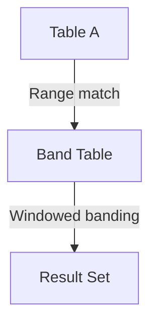

# NON‑EQUI JOIN — Advanced Template

## 1. Purpose
Perform a **range‑based analytical join** where:
- A row from A must fall within a band or interval defined in B  
- B is window‑ranked to select the most relevant band  
- Useful for pricing tiers, tax brackets, salary bands, scoring models  

## 2. Four-Part Flow
- First Part: Analytical subquery Bx (band table)  
- Second Part: Main table A  
- Third Part: NON‑EQUI JOIN using BETWEEN or range logic  
- Fourth Part: Final SELECT with analytical band metrics  

## 3. Template
```sql
WITH Bx AS (                                      -- First Part
    SELECT
        B.<min_value>,
        B.<max_value>,
        B.<band_label>,
        ROW_NUMBER() OVER (
            PARTITION BY B.<band_group>
            ORDER BY B.<priority> DESC
        ) AS rn,
        AVG(B.<rate>) OVER (
            PARTITION BY B.<band_group>
        ) AS avg_rate
    FROM <table_2> B
)
SELECT                                              -- Fourth Part
    A.<column_list_from_A>,
    Bx.band_label,
    Bx.avg_rate
FROM <table_1> A                                    -- Second Part
JOIN Bx                                             -- Third Part
    ON A.<value> BETWEEN Bx.<min_value> AND Bx.<max_value>
   AND Bx.rn = 1;
```
