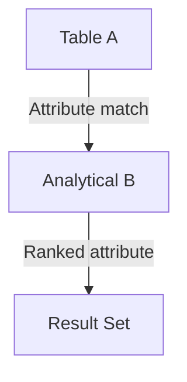

# NON‑KEY JOIN — Advanced Template

## 1. Purpose
Perform an analytical join using **non‑key attributes**, where:
- Matching is based on descriptive fields (email, region, category, etc.)  
- B is window‑ranked to select the most relevant attribute match  
- Useful for data integration, deduplication, and business‑rule matching  

## 2. Four-Part Flow
- First Part: Analytical subquery Bx  
- Second Part: Main table A  
- Third Part: Attribute‑based join (non‑key)  
- Fourth Part: Final SELECT with enriched metrics  

## 3. Template
```sql
WITH Bx AS (                                      -- First Part
    SELECT
        B.<non_key_attribute>,
        B.<column_list_from_B>,
        ROW_NUMBER() OVER (
            PARTITION BY B.<non_key_attribute>
            ORDER BY B.<priority> DESC
        ) AS rn,
        MAX(B.<value>) OVER (
            PARTITION BY B.<non_key_attribute>
        ) AS max_value
    FROM <table_2> B
    WHERE B.<status> IN ('Active','Pending')
)
SELECT                                              -- Fourth Part
    A.<column_list_from_A>,
    Bx.<column_list_from_B>,
    Bx.max_value
FROM <table_1> A                                    -- Second Part
JOIN Bx                                             -- Third Part
    ON A.<non_key_attribute> = Bx.<non_key_attribute>
   AND Bx.rn = 1;
```
