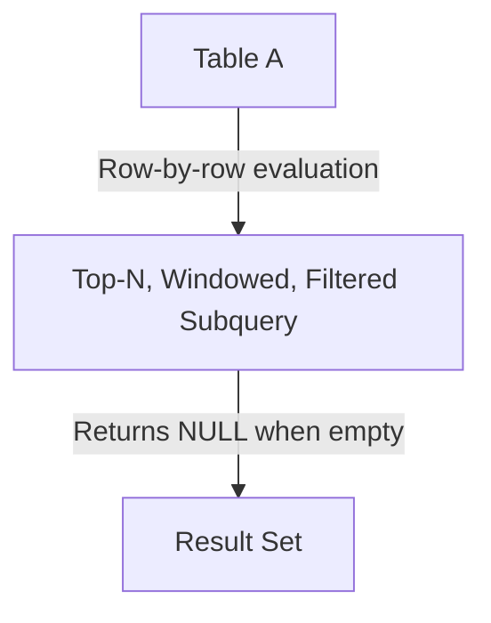

# OUTER APPLY — Advanced Template

## 1. Purpose
Execute a correlated, row-by-row subquery that can perform:
- Top‑N selection  
- Window function filtering  
- Complex business rules  
- Dynamic parameterization using columns from A  
Return NULL‑extended rows when the subquery produces no result.

## 2. Four-Part Flow
- First Part: Main table A  
- Second Part: Lateral subquery B  
- Third Part: Advanced correlation logic  
- Fourth Part: Final SELECT  

## 3. Template
```sql
SELECT
    A.<column_list_from_A>,
    B.<derived_metrics>,
    B.<top_ranked_value>,
    B.<window_filtered_value>
FROM <table_1> A
OUTER APPLY (
    SELECT TOP (1)
           X.<column_list_from_B>,
           X.<metric_1>,
           X.<metric_2>,
           ROW_NUMBER() OVER (
               PARTITION BY X.<partition_key>
               ORDER BY X.<sort_key> DESC
           ) AS rn,
           SUM(X.<value>) OVER (
               PARTITION BY X.<partition_key>
           ) AS total_value
    FROM <table_2> X
    WHERE X.<foreign_key> = A.<primary_key>
      AND X.<status> IN ('Active','Pending')
      AND X.<date> >= DATEADD(DAY, -90, A.<event_date>)
    ORDER BY X.<priority> DESC, X.<created_at> DESC
) B;
```
