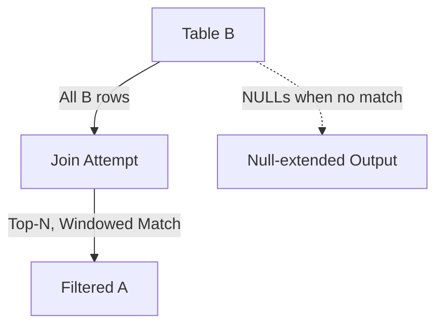

# RIGHT JOIN — Advanced Template

## 1. Purpose
Return all rows from B while enriching them with:
- Analytical, ranked, or filtered values from A  
- Multi‑predicate correlation  
- Window‑based metrics  
NULLs appear when no qualifying A row exists.

## 2. Four-Part Flow
- First Part: Analytical subquery A  
- Second Part: Main table B  
- Third Part: RIGHT JOIN with ranking filter  
- Fourth Part: Final SELECT with NULL‑safe enrichment  

## 3. Template
```sql
WITH Ax AS (
    SELECT
        A.<column_list_from_A>,
        ROW_NUMBER() OVER (
            PARTITION BY A.<partition_key>
            ORDER BY A.<score> DESC
        ) AS rn,
        MAX(A.<metric>) OVER (
            PARTITION BY A.<partition_key>
        ) AS max_metric
    FROM <table_1> A
    WHERE A.<flag> = 'Y'
)
SELECT
    Ax.<column_list_from_A>,
    B.<column_list_from_B>,
    Ax.max_metric
FROM Ax
RIGHT JOIN <table_2> B
    ON Ax.<join_key> = B.<join_key>
   AND Ax.rn = 1;
```
