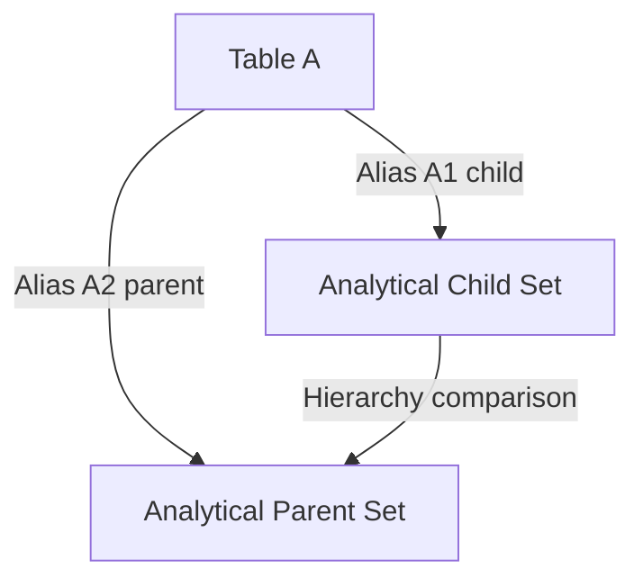

# SELF JOIN — Advanced Template

## 1. Purpose
Perform an intra‑table analytical join where:

- The same table is split into child and parent analytical sets  
- Window functions compute sibling metrics, ordering, and historical values  
- Useful for hierarchy modeling, latest‑child selection, and comparative analysis  

## 2. Four-Part Flow
- First Part: Analytical subquery A1 (child perspective)  
- Second Part: Analytical subquery A2 (parent perspective)  
- Third Part: SELF JOIN linking child to parent  
- Fourth Part: Final SELECT with comparative metrics  

## 3. Template
```sql
WITH A1 AS (                                      -- First Part (child set)
    SELECT
        A.<id>              AS child_id,
        A.<parent_id>,
        A.<value>           AS child_value,
        ROW_NUMBER() OVER (
            PARTITION BY A.<parent_id>
            ORDER BY A.<created_at> DESC
        ) AS rn_child,
        LAG(A.<value>) OVER (
            PARTITION BY A.<parent_id>
            ORDER BY A.<created_at>
        ) AS prev_child_value
    FROM <table> A
    WHERE A.<status> = 'Active'
),
A2 AS (                                           -- Second Part (parent set)
    SELECT
        A.<id>              AS parent_id,
        A.<value>           AS parent_value,
        SUM(A.<value>) OVER (
            PARTITION BY A.<id>
        ) AS total_child_value,
        COUNT(*) OVER (
            PARTITION BY A.<id>
        ) AS child_count
    FROM <table> A
    WHERE A.<is_parent_flag> = 1
)
SELECT                                             -- Fourth Part
    A1.child_id,
    A2.parent_id,
    A1.child_value,
    A1.prev_child_value,
    A2.parent_value,
    A2.total_child_value,
    A2.child_count
FROM A1                                           -- Third Part
JOIN A2
    ON A1.<parent_id> = A2.parent_id
   AND A1.rn_child = 1;
```
