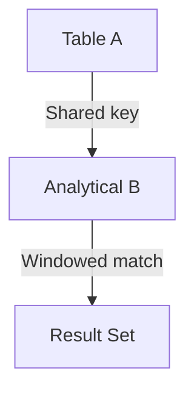

# USING JOIN — Advanced Template

## 1. Purpose
Perform an analytical join using a **shared column** without table prefixes, where:
- Both tables are window‑processed  
- Ranking filters ensure only the top analytical rows join  
- USING clause simplifies join logic  

## 2. Four-Part Flow
- First Part: Analytical subquery Ax  
- Second Part: Analytical subquery Bx  
- Third Part: JOIN USING (<shared_column>)  
- Fourth Part: Final SELECT with enriched metrics  

## 3. Template
```sql
WITH Ax AS (                                      -- First Part
    SELECT
        A.<shared_column>,
        A.<column_list_from_A>,
        ROW_NUMBER() OVER (
            PARTITION BY A.<shared_column>
            ORDER BY A.<created_at> DESC
        ) AS rnA,
        SUM(A.<metric>) OVER (
            PARTITION BY A.<shared_column>
        ) AS totalA
    FROM <table_1> A
),
Bx AS (                                           -- Second Part
    SELECT
        B.<shared_column>,
        B.<column_list_from_B>,
        ROW_NUMBER() OVER (
            PARTITION BY B.<shared_column>
            ORDER BY B.<score> DESC
        ) AS rnB,
        MAX(B.<value>) OVER (
            PARTITION BY B.<shared_column>
        ) AS maxB
    FROM <table_2> B
)
SELECT                                              -- Fourth Part
    Ax.<column_list_from_A>,
    Bx.<column_list_from_B>,
    Ax.totalA,
    Bx.maxB
FROM Ax                                             -- Third Part
JOIN Bx
USING (<shared_column>)
WHERE Ax.rnA = 1
  AND Bx.rnB = 1;
```
