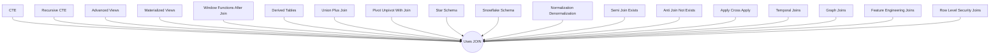

```mermaid
flowchart TD

    A[CTE] --> R1((Uses JOIN))
    B[Recursive CTE] --> R1
    C[Advanced Views] --> R1
    D[Materialized Views] --> R1
    E[Window Functions After Join] --> R1
    F[Derived Tables] --> R1
    G[Union Plus Join] --> R1
    H[Pivot Unpivot With Join] --> R1
    I[Star Schema] --> R1
    J[Snowflake Schema] --> R1
    K[Normalization Denormalization] --> R1
    L[Semi Join Exists] --> R1
    M[Anti Join Not Exists] --> R1
    N[Apply Cross Apply] --> R1
    O[Temporal Joins] --> R1
    P[Graph Joins] --> R1
    Q[Feature Engineering Joins] --> R1
    R[Row Level Security Joins] --> R1
```
