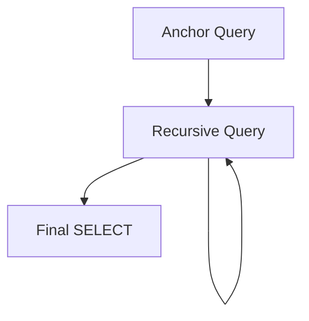

2. Recursive CTE — Simple Template
Diagram


Purpose
Generate hierarchical or iterative results by repeatedly referencing the CTE until a termination condition is met.

Four-Part Flow

First Part: Anchor query

Second Part: Recursive query

Third Part: Termination condition

Fourth Part: Final SELECT

```SQL
WITH RECURSIVE RCTE AS (                         -- First + Second Part
    SELECT                                        -- Anchor Query
        <id>,
        <parent_id>,
        <column_list>,
        1 AS lvl
    FROM <table>
    WHERE <anchor_condition>

    UNION ALL                                     -- Recursive Step
    SELECT
        T.<id>,
        T.<parent_id>,
        T.<column_list>,
        R.lvl + 1 AS lvl
    FROM <table> T                                -- Second Part
    INNER JOIN RCTE R                             -- Self-reference
        ON T.<parent_id> = R.<id>                 -- Third Part
)
SELECT *                                          -- Fourth Part
FROM RCTE;```
