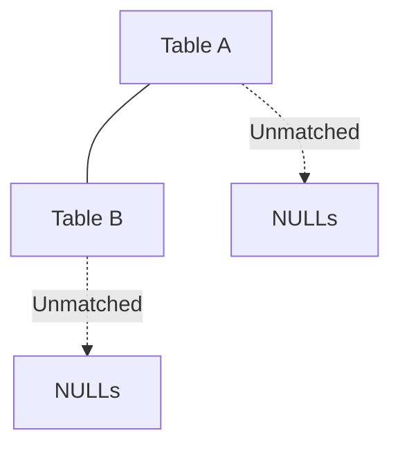

# FULL JOIN — Simple Template

## 1. Purpose
Return all rows from both tables; unmatched rows become NULL on either side.

## 2. Four-Part Flow
- First Part: Main table A  
- Second Part: Join table B  
- Third Part: Join condition  
- Fourth Part: Final SELECT  

## 3. Template
```sql
SELECT
    A.<column_list_from_A>,         
    B.<column_list_from_B>
FROM <table_1> A                    
FULL JOIN <table_2> B               
    ON A.<join_key_1> = B.<join_key_2>;
```
