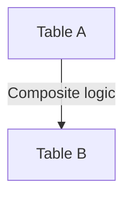

# COMPOSITE / LOGICAL JOIN — Simple Template

## 1. Purpose
Join tables using compound logical expressions.

## 2. Four-Part Flow
- First Part: Main table A  
- Second Part: Join table B  
- Third Part: Logical join condition  
- Fourth Part: Final SELECT  

## 3. Template
```sql
SELECT
    A.<column_list_from_A>,
    B.<column_list_from_B>
FROM <table_1> A
JOIN <table_2> B
    ON A.<key1> = B.<key1>
   OR (A.<key2> = B.<key2> AND A.<flag> = 'Y');
```
