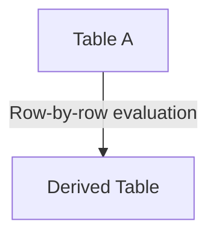

# LATERAL JOIN / CROSS APPLY — Simple Template

## 1. Purpose
Apply a subquery to each row of A.

## 2. Four-Part Flow
- First Part: Main table A  
- Second Part: Lateral subquery B  
- Third Part: Condition inside subquery  
- Fourth Part: Final SELECT  

## 3. Template
```sql
SELECT
    A.<column_list_from_A>,
    B.<column_list_from_B>
FROM <table_1> A
CROSS APPLY (
    SELECT <column_list_from_B>
    FROM <table_2>
    WHERE <conditions_using_A>
) B;
```
