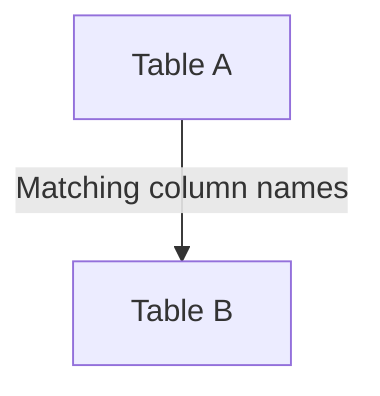

# NATURAL JOIN — Simple Template

## 1. Purpose
Join tables automatically using columns with the same names.

## 2. Four-Part Flow
- First Part: Main table A  
- Second Part: Join table B  
- Third Part: Auto join on shared column names  
- Fourth Part: Final SELECT  

## 3. Template
```sql
SELECT *
FROM <table_1> A
NATURAL JOIN <table_2> B;
```
