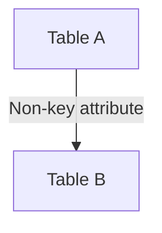

# NON KEY JOIN — Simple Template

## 1. Purpose
Join tables using non‑primary‑key attributes.

## 2. Four-Part Flow
- First Part: Main table A  
- Second Part: Join table B  
- Third Part: Non‑key join condition  
- Fourth Part: Final SELECT  

## 3. Template
```sql
SELECT
    A.<column_list_from_A>,
    B.<column_list_from_B>
FROM <table_1> A
JOIN <table_2> B
    ON A.<non_key_column> = B.<non_key_column>;
```
