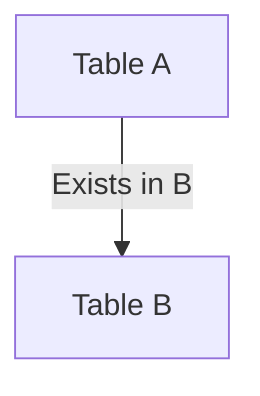

# SEMI JOIN (EXISTS) — Simple Template

## 1. Purpose
Return rows from A where matching rows exist in B.

## 2. Four-Part Flow
- First Part: Main table A  
- Second Part: Subquery table B  
- Third Part: EXISTS condition  
- Fourth Part: Final SELECT  

## 3. Template
```sql
SELECT
    A.<column_list_from_A>
FROM <table_1> A
WHERE EXISTS (
    SELECT 1
    FROM <table_2> B
    WHERE A.<join_key_1> = B.<join_key_2>
);
```
