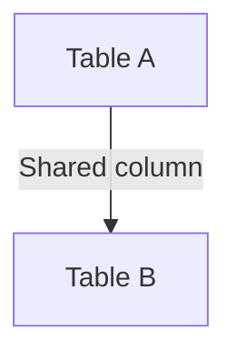

# USING JOIN — Simple Template

## 1. Purpose
Join tables using a shared column without prefixing table names.

## 2. Four-Part Flow
- First Part: Main table A  
- Second Part: Join table B  
- Third Part: USING clause  
- Fourth Part: Final SELECT  

## 3. Template
```sql
SELECT
    A.*,         
    B.*
FROM <table_1> A
JOIN <table_2> B
USING (<shared_column>);
```
