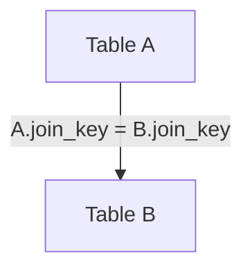

# INNER JOIN — Simple Template

## 1. Purpose

An INNER JOIN returns only the rows where both tables have a matching key.
If there is no match, the row is discarded.

## 2. Four-Part Flow
- First Part: Main table A  
- Second Part: Join table B  
- Third Part: Join condition  
- Fourth Part: Final SELECT  

## 3. Template
```sql
SELECT
    A.<column_list_from_A>,         -- Fourth Part
    B.<column_list_from_B>
FROM <table_1> A                    -- First Part
INNER JOIN <table_2> B              -- Second Part
    ON A.<join_key_1> = B.<join_key_2>;  -- Third Part
```
