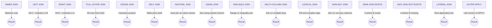

```mermaid
flowchart TD

    A[INNER JOIN] -->|Matches only| R1((Result))
    B[LEFT JOIN] -->|All A + matches in B| R2((Result))
    C[RIGHT JOIN] -->|All B + matches in A| R3((Result))
    D[FULL OUTER JOIN] -->|All rows from both| R4((Result))
    E[CROSS JOIN] -->|Cartesian product| R5((Result))
    F[SELF JOIN] -->|Table joins itself| R6((Result))
    G[NATURAL JOIN] -->|Auto join on same names| R7((Result))
    H[USING JOIN] -->|Join using shared column| R8((Result))
    I[NON-EQUI JOIN] -->|Range or inequality join| R9((Result))
    J[MULTI-COLUMN JOIN] -->|Join on multiple keys| R10((Result))
    K[LOGICAL JOIN] -->|OR and complex logic| R11((Result))
    L[NON-KEY JOIN] -->|Join on non-key columns| R12((Result))
    M[SEMI JOIN EXISTS] -->|A where B exists| R13((Result))
    N[ANTI JOIN NOT EXISTS] -->|A where B missing| R14((Result))
    O[LATERAL JOIN] -->|Row dependent join| R15((Result))
    P[OUTER APPLY] -->|Left version of APPLY| R16((Result))

```
